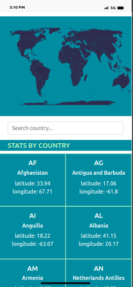

<a name="readme-top"></a>

<div align="center">
   <h3><b>Microverse README Template</b></h3>

</div>

# 📗 Table of Contents

- [📗 Table of Contents](#-table-of-contents)
- [📖 \[Breezer air quality app\] ](#-breezer-air-quality-app-)
  - [🛠 Built With ](#-built-with-)
    - [Tech Stack ](#tech-stack-)
    - [Key Features ](#key-features-)
  - [🚀 Live Demo ](#-live-demo-)
  - [💻 Getting Started ](#-getting-started-)
    - [Prerequisites](#prerequisites)
    - [Setup](#setup)
    - [Install](#install)
    - [Usage](#usage)
    - [Run tests](#run-tests)
  - [👥 Author ](#-author-)
  - [🔭 Future Features ](#-future-features-)
  - [🤝 Contributing ](#-contributing-)
  - [🙏 Acknowledgments ](#-acknowledgments-)
  - [📝 License ](#-license-)

<!-- PROJECT DESCRIPTION -->

# 📖 [Breezer air quality app] <a name="about-project"></a>

**[Breezer air quality app]** is a mobile web application that pulls data from the OpenWeatherMap API to allow users to search for and view the forecast in different cities around the world. Built with React & Redux.

<div align="center">
 
  
  <br/>
  </div>

## 🛠 Built With <a name="built-with"></a>

### Tech Stack <a name="tech-stack"></a>

<details>
  <summary>Client</summary>
  <ul>
    <li><a href="https://reactjs.org/">React.js</a></li>
  </ul>
</details>

<details>
  <summary>Server</summary>
  <ul>
    <li><a href="https://nodejs.com/">Node.js</a></li>
  </ul>
</details>

<!-- Features -->

### Key Features <a name="key-features"></a>

- **[User can search specific location]**
- **[User can view forecasted air quality index generated for every hour in a specific location]**
- **[The app interprets the air quality index to the user, and what each scale implies]**

<p align="right">(<a href="#readme-top">back to top</a>)</p>

<!-- LIVE DEMO -->

## 🚀 Live Demo <a name="live-demo"></a>

- [Live Demo Link](https://airqualityweather.onrender.com)


<p align="right">(<a href="#readme-top">back to top</a>)</p>

<!-- GETTING STARTED -->

## 💻 Getting Started <a name="getting-started"></a>

To get a local copy up and running, follow these steps.

### Prerequisites

In order to run this project you need:

```sh
 npm install
```

### Setup

Clone this repository to your desired folder:

```sh
  cd PATH
  git clone git@github.com:ginabeki/airquality_app.git
```

### Install

Install this project with:

```sh
  cd my-project
  npm install
```

### Usage

To run the project, execute the following command:

```sh
  npm run start
```

### Run tests

To run tests, run the following command:

```sh
  npm run test
```

<p align="right">(<a href="#readme-top">back to top</a>)</p>

## 👥 Author <a name="authors"></a>

- GitHub: [@ginabeki](https://github.com/ginabeki)
- Twitter: [@gina_bw](https://twitter.com/_gina_bw)
- LinkedIn: [ginabeki](https://linkedin.com/in/ginabeki)

<p align="right">(<a href="#readme-top">back to top</a>)</p>

<!-- FUTURE FEATURES -->

## 🔭 Future Features <a name="future-features"></a>


- [ ] **[Add plotting graphs that indicate wind direction and speed, air temperature and dew point, barometric pressure and its change during the preceding hours]**
- [ ] **[Include maps for every location a user searches to improve visualization]**

<p align="right">(<a href="#readme-top">back to top</a>)</p>

<!-- CONTRIBUTING -->

## 🤝 Contributing <a name="contributing"></a>

Contributions, issues, and feature requests are welcome!

Feel free to check the [issues page](https://github.com/ginabeki/airquality_app/issues).

<p align="right">(<a href="#readme-top">back to top</a>)</p>

<!-- SUPPORT -->
## 🙏 Acknowledgments <a name="acknowledgements"></a>

I would like to thank...

- Design is inspired from a design made by [Nelson Sakwa](https://www.behance.net/sakwadesignstudio).
- Linters are made by [Microverse Inc](https://github.com/microverseinc).

<p align="right">(<a href="#readme-top">back to top</a>)</p>

<!-- LICENSE -->

## 📝 License <a name="license"></a>

This project is [MIT](./MIT.md) licensed.

<p align="right">(<a href="#readme-top">back to top</a>)</p>
